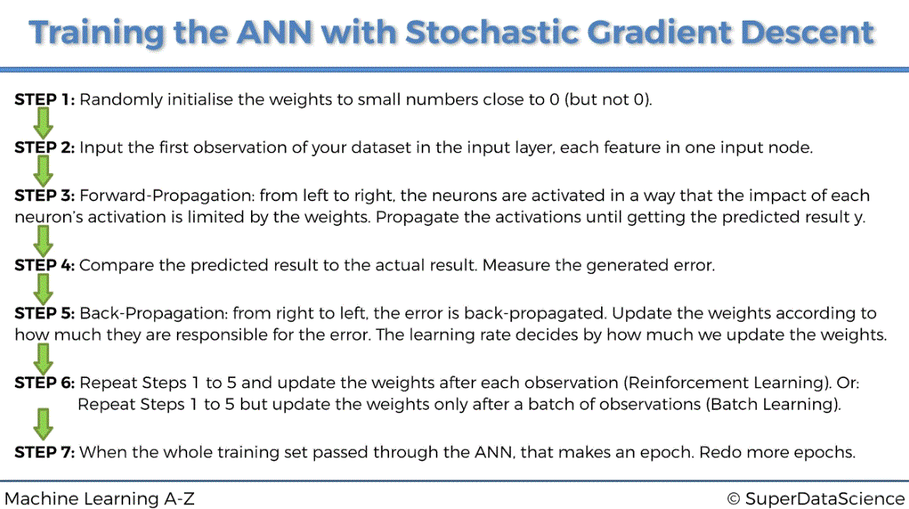

# Artificial Neural Networks

The example data set represents customers of a bank. The bank has seen unusually large numbers of customers closing accounts (high churn) and wants to address this. The data is a random sample of customers.

We use the sample dataset to build a model to predict which customers are at risk of leaving the bank.

The neural network model requires intensive processing so we use libraries to parallelise where possible. This is the algorithm for training the network:

But we don't need to implement forward or backward propagation in full as in this example the library does that for us. The example shows how to configure the correct parameters.